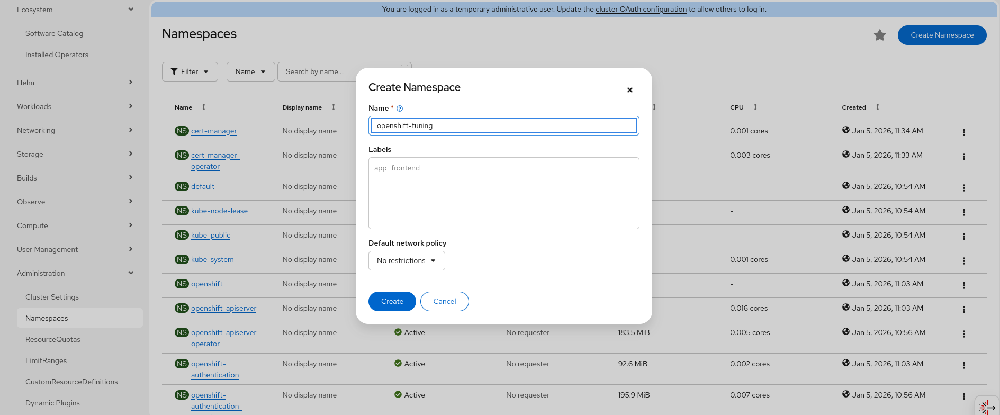
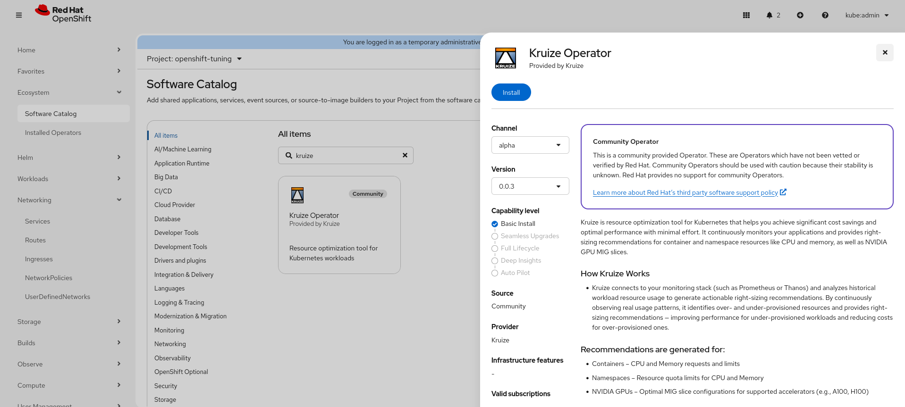
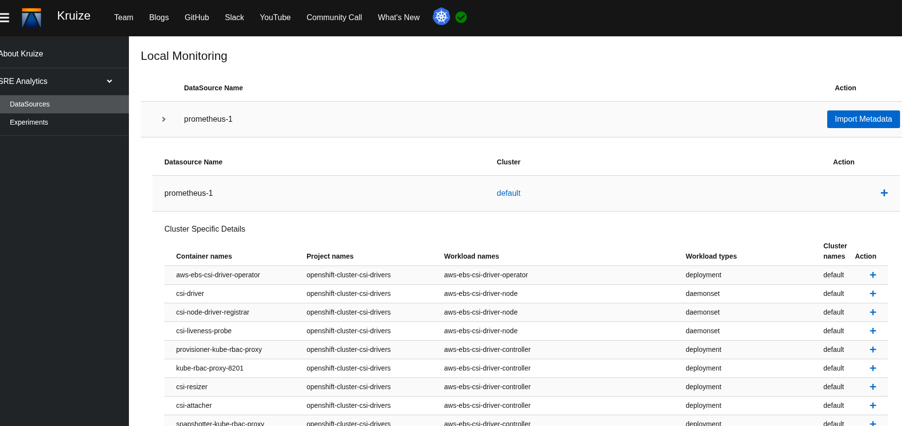
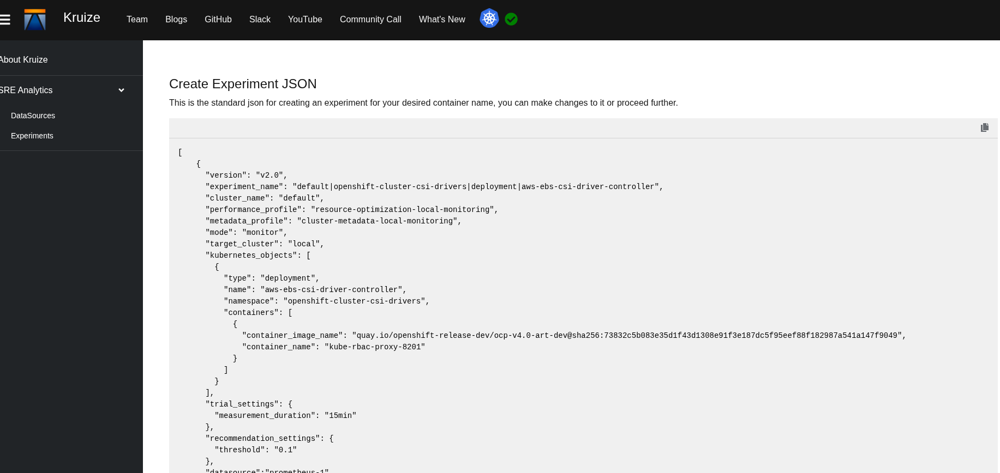

# Installing Kruize on OpenShift via Operator

Kruize can be installed using the Kruize Operator on OpenShift clusters. The operator simplifies deployment and management through Custom Resource Definitions (CRDs).

For operator source code, see the [kruize-operator repository](https://github.com/kruize/kruize-operator).

## Prerequisites

- OpenShift Container Platform 4.10+
- Cluster admin access
- Prometheus monitoring (included by default in OpenShift)
- `oc` CLI tool configured

## Installing Kruize Operator and Kruize

### Step 1: Create openshift-tuning Project 

Before installing the Kruize Operator, you need to create the `openshift-tuning` project if it's not already present:

1. Navigate to **Administration → Namespace**
2. Click **Create Project** on the top right corner
3. Enter **openshift-tuning** as the Name
4. Click **Create**


### Step 2: Install Kruize Operator

1. Navigate to **Ecosystem → OperatorHub/Software Catalog**
2. Search for **kruize**
3. Click the **Kruize Operator** tile. It should be the community version.
4. Click **Install**

5. Configure:
   - **Update approval**: Automatic (recommended)
   - **Installed Namespace**: openshift-tuning
6. Click **Install** and wait for the status to show **Succeeded**.


Once the Kruize operator is up and running, you can follow the next steps to install Kruize.

### Step 3: Create Kruize Instance

1. Navigate to **Ecosystem → Installed Operators**
2. Click **Kruize Operator**
3. Click **Create instance**
4. Review the YAML and click **Create**

Verify that the Kruize deployment is up and running:
```bash
oc get pods -n openshift-tuning
```

## Accessing Kruize UI

### Step 1: Accessing Routes via OpenShift Console

Note: If routes are already present for Kruize then this step can be skipped.

Since the operator does not expose the services by default, you must create routes manually through the OpenShift Console. You need to create two routes: one for Kruize Service (to install profiles) and one for Kruize UI (to view the dashboard).

**Navigate to Routes:**

1. In the Administrator perspective, go to **Networking → Routes**.
2. Ensure the **Project** dropdown at the top is set to **openshift-tuning** (or your installation project).
3. Click the **Plus (+) icon** (Import YAML) in the top-right.

**Create the API Route:**

Paste this YAML and click **Create** to create the Kruize API route:

```yaml
apiVersion: route.openshift.io/v1
kind: Route
metadata:
  name: kruize-route
  namespace: openshift-tuning
spec:
  to:
    kind: Service
    name: kruize
  port:
    targetPort: kruize-port
```

**Create the UI Route:**

Click the **Plus (+) icon** again, paste this YAML and click **Create** to create the Kruize UI route:

```yaml
apiVersion: route.openshift.io/v1
kind: Route
metadata:
  name: kruize-ui-route
  namespace: openshift-tuning
spec:
  to:
    kind: Service
    name: kruize-ui-nginx-service
  port:
    targetPort: 8080
```

### Step 2: Configure API URL for Profile Installation

After creating the routes, you need to export the Kruize API URL for use in profile installation.

1. Navigate to **Networking → Routes** in the OpenShift Console (if not already there).
2. Copy the URL under the **Location** column for **kruize-route**.
3. Run the following command in your terminal (replace with your copied URL):

```bash
export KRUIZE_URL="<PASTE_YOUR_KRUIZE_ROUTE_URL_HERE>"
```

**Note**: This variable is required for installing profiles in the next steps.

### Step 3: Clone Kruize Repository

To install the required profiles, you need to clone the Kruize repository:

```bash
git clone https://github.com/kruize/autotune.git
cd autotune
```

### Step 4: Install Required Profiles

Before creating experiments, you must install Metadata and Metric profiles. These define how Kruize collects and analyzes metrics.

**Note**: Make sure you are in the `autotune` directory cloned in the previous step.

```bash
# Install Metadata Profile
curl -X POST "${KRUIZE_URL}/createMetadataProfile" \
  -H "Content-Type: application/json" \
  -d @manifests/autotune/metadata-profiles/bulk_cluster_metadata_local_monitoring.json

# Install Metric Profile
curl -X POST "${KRUIZE_URL}/createMetricProfile" \
  -H "Content-Type: application/json" \
  -d @manifests/autotune/performance-profiles/resource_optimization_local_monitoring.json
```

**Note**: If you receive a "Profile already exists" error, you can safely ignore it.

### Step 5: Access Kruize UI in Browser

Now that the profiles are installed, you can access the Kruize UI:

1. Navigate to **Networking → Routes** in the OpenShift Console
2. Copy the URL under the **Location** column for **kruize-ui-route**
3. Open your web browser and paste the URL
4. You should see the Kruize dashboard with tabs for DataSources, Experiments, and more

## Using Kruize UI

### Create Experiment via UI

1. In the Kruize UI, click **DataSources** in the left sidebar. You will see your connected data source (e.g., `prometheus-1`)
2. Click the **Import Metadata** button. Then click on the cluster name (eg. default). Find the workload you want to optimize (e.g., `aws-ebs-csi-driver-controller`)
3. Click the **Plus (+)** icon next to that workload. Kruize will automatically generate the experiment JSON


4. A page titled **"Create Experiment JSON"** will appear. Verify the details:
   - `experiment_name`
   - `container_name`
   - `image_name`
5. Click **Create** to finalize the experiment



### View Recommendations

1. Click **Experiments** in the left sidebar
2. Click on your experiment name (e.g., `aws-ebs-csi-driver-node`)
3. You should see: **"Generating Recommendations"** 

- **Note**: If you see "CPU Usage is less than a millicore", the workload is idle but data collection is active
4. Toggle between **Cost Optimizations** and **Performance Optimizations** tabs
5. Review the CPU/Memory suggestions:
   - **Current Settings**: Your existing resource requests/limits
   - **Recommended Settings**: Optimized values based on actual usage
6. View charts showing historical usage patterns
7. Download recommendations for implementation

You can now use Kruize to generate and apply resource optimization recommendations for your workloads.